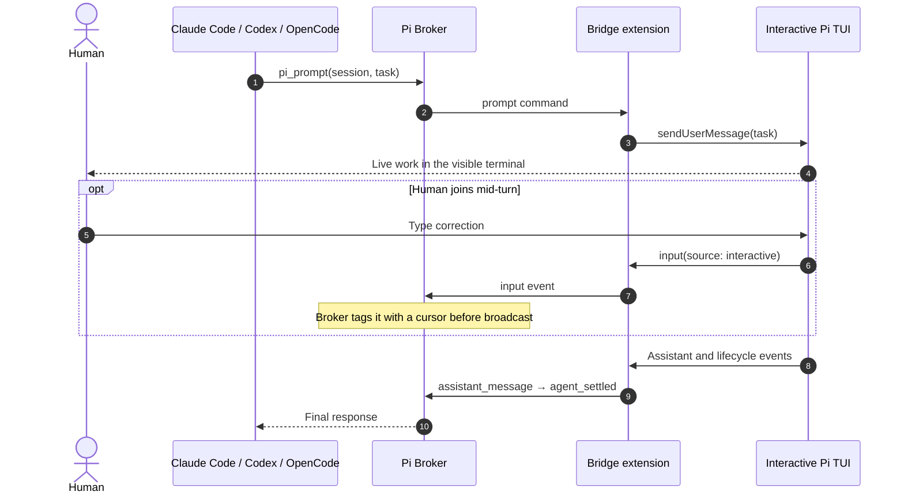
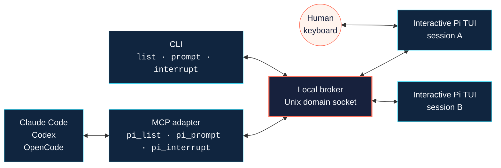

<h1 align="center">Pi Broker</h1>

<p align="center"><strong>Delegate a turn to a Pi session you can actually watch — and type into.</strong></p>

<p align="center">
  
</p>

Pi Broker lets Claude Code, Codex, or OpenCode send a turn to a real,
persistent, interactive `pi` session running in an ordinary terminal on your
machine. Not a headless subprocess. Not a captured transcript replayed
afterwards. The same TUI you started yourself, in a window you can see, with a
cursor you can take over mid-task.

It deliberately does not use `pi -p`, `--print`, `--mode json`, or `--mode rpc`.
Those modes still exist and standalone Pi is untouched — they are simply
forbidden for the delegated-agent path, because the whole point is that the
session stays interactive.

Status: **v0.1, local-only, single-user, experimental.** See
[what this does not claim](#what-this-does-not-claim) before you build on it.

---

## Why this exists

Every major coding host now has a way to hand work to a background agent —
Claude Code's `Task`/`Agent` tool, and the comparable delegated-subagent
patterns in Codex and OpenCode. They are good at what they are for: autonomous
work you want done while you think about something else. Fire and forget,
collect the report.

The cost of that design is opacity, and it runs in both directions:

- **You can't watch.** There is no terminal to look at while it works. You get a
  final report, maybe a transcript after the fact.
- **You can't join.** There is no keyboard to grab. If the agent is heading the
  wrong way three tool calls in, you wait for it to finish and then start over
  with a better prompt.
- **The orchestrator can't watch either.** The delegating model fires a prompt
  into the same black box and blocks until a result comes back. It has no
  turn-by-turn signal about what the delegate is doing, and no way to tell its
  own instructions apart from anything else that touched the session.

Pi Broker attacks the other problem: **not "run this unattended," but "run this
where both of us can see it."** A delegated Pi session remains a normal,
watchable, joinable terminal session for its entire life. The human at the
terminal and the AI orchestrating it are looking at the same live conversation,
and either can speak into it.

This is not a replacement for background agent tools. It is the case they do not
attempt.

### Mutual visibility, concretely

The bridge extension forwards Pi's real lifecycle events over the broker socket
as they happen — `session_start`, `input`, `agent_start`, `agent_end`,
`agent_settled`, `assistant_message`, and `permission_decision` from the
permission layer. Two consequences follow:

1. **The orchestrator sees the work, not just the verdict.** It can observe the
   session entering and leaving a turn, watch assistant messages land, and see
   how each permission prompt resolved — while the turn is still running.
2. **Both sides can tell who said what.** Each `input` event carries a `source`:
   prompts injected by the extension are tagged `extension`, keystrokes typed by
   the human at the TUI are tagged `interactive`. Delegated input and human
   input flow into one conversation without becoming indistinguishable in it.

So a human can type a correction into the same session mid-delegation, the
orchestrator can see that a human turn arrived and adjust, and no one is
reconstructing what happened from a log afterwards.



---

## How it works



Four small pieces, no daemon manager, no wrapper around the `pi` binary:

- **`src/broker.mjs`** — a local Unix-domain-socket server that tracks registered
  interactive Pi sessions by ID, routes commands to a named target, and
  broadcasts cursor-tagged events to connected controllers.
- **`extensions/pi-broker-bridge.ts`** — a Pi extension, loaded explicitly per
  process. It registers the session with the broker, injects delegated prompts
  through `sendUserMessage` (steering if the agent is mid-turn, plain if idle),
  forwards the lifecycle events above, and accepts interrupt and shutdown.
- **`bin/pi-broker.mjs`** — one dispatcher: `serve`, `list`, `prompt`,
  `interrupt`, `mcp`.
- **`src/mcp-server.mjs`** — a stdio MCP adapter exposing exactly three tools —
  `pi_list`, `pi_prompt`, `pi_interrupt` — to any MCP-speaking host.

The CLI and the MCP adapter are two front doors onto the same three operations,
so a host that speaks MCP and a human at a shell get identical capability.

### Why this stack

- **Unix socket, not TCP.** v0.1 is local-only. TCP would introduce remote
  authentication and exposure that nothing here has proved.
- **Normal Pi TUI plus an extension, not RPC or print mode.** Direct human
  interaction is the requirement, not a nice-to-have; the real-PTY proof passes
  with no headless flag anywhere in the process table.
- **One MCP adapter, not three host-specific plugins.** All three host
  configuration surfaces were exercised against the same adapter. Separate
  adapters would add maintenance cost nothing has justified.
- **Manual terminal launch, not tmux or a pane manager.** Remote terminal
  attachment has no proof behind it. Ordinary terminal tabs preserve the
  interaction model that does.

---

## Fastest way to try it

```bash
npm ci
npm run quickstart
```

That one command picks a temporary socket, starts the broker in the background,
and opens **two real terminal windows** — one per Pi session — each already
running a normal interactive `pi` TUI with the bridge extension loaded and
`PI_BROKER_SOCKET` / `PI_BROKER_SESSION_ID` already set. The windows are titled
`pi-broker session-a` and `pi-broker session-b`, so moving between sessions is
ordinary window switching (Cmd-\` in Terminal, or Mission Control).

Which window it opens depends on the machine — see
[Which terminal gets opened](#which-terminal-gets-opened). On a machine where
no window can be opened at all, it stops and tells you the exact command to run
by hand; it never falls back to a hidden Pi.

It prints, in the terminal you ran it from, the exact commands with the socket
path already filled in:

```text
  See who registered:
    npm exec -- pi-broker list /tmp/pi-broker-quickstart.XXXXXX/broker.sock

  Send a turn into a session:
    npm exec -- pi-broker prompt /tmp/pi-broker-quickstart.XXXXXX/broker.sock session-a 'say hello from the broker'
```

When you are done:

```bash
npm run quickstart:stop
```

That kills the broker and removes its socket. The two Pi windows are ordinary
terminals — close them yourself, or keep typing in them.

This is only automation of the manual sequence below: same broker, same
ordinary interactive Pi, same explicit `--extension`, no headless mode, no
process manager, no new protocol. It opens the same windows you would open by
hand. If you would rather not have windows opened for you, use the manual
sequence.

`PI_QUICKSTART_DIR` overrides the directory used for the socket and the small
state file (default `/tmp`, kept short because a Unix socket path is capped at
104 bytes).

`PI_QUICKSTART_TARGET_DIR` points the launched Pi sessions' own working
directory — the one governing their `bash`/`read`/`edit` sandbox — at a
different repository, so a controller can dispatch coding work against some
other project instead of Pi Broker's own directory. Requires `npm install` to
have already been run in Pi Broker's directory (`node_modules/.bin/pi` must
exist: in this mode `pi` is launched by its resolved absolute path rather than
via `npm exec`, since `npm exec` needs to run from Pi Broker's own directory
to resolve — the opposite of what this option is for). Left unset, sessions
run with cwd at Pi Broker's own directory, same as always:

```bash
PI_QUICKSTART_TARGET_DIR=/path/to/other/repo npm run quickstart -- 1
```

### Which terminal gets opened

One shared opener — `scripts/open-pi-windows.mjs`, in Node because Node is the
one runtime this project already requires everywhere — is used by both
`npm run quickstart` and the MCP adapter's on-demand provisioning. It writes one
launcher script per session and hands it to whatever this machine actually has:

| Platform | What it uses | Evidence |
| --- | --- | --- |
| macOS | `osascript` driving Terminal.app, one window per session | proven end to end (`npm run quickstart`, [docs/proofs/2026-08-11-mcp-autoprovision.md](docs/proofs/2026-08-11-mcp-autoprovision.md)) |
| Linux / BSD | the first installed emulator of `x-terminal-emulator`, `gnome-terminal`, `konsole`, `xfce4-terminal`, `alacritty`, `kitty`, `wezterm`, `foot`, `xterm` — requires `DISPLAY` or `WAYLAND_DISPLAY` | proven end to end in a Linux container: real X display, real `xterm` windows, sessions registered, prompt round-tripped |
| WSL | the Linux path when WSLg or an X server gives it a display; otherwise a Windows-side window via `wt.exe`/`cmd.exe` running `wsl.exe -d <distro> -- bash <launcher>` | detection and command construction verified in a container with a stubbed `wt.exe`; **not run on real WSL** |
| Windows (native) | `wt.exe new-tab --title …`, falling back to `cmd.exe /c start "<title>" …`, then PowerShell `Start-Process` | **implemented, unverified on real Windows hardware** — unit-tested argv only |

Window titles are set by the launcher itself (an OSC 0 escape on POSIX, `title`
in the generated `.cmd`), because terminal emulators disagree about title flags.

If nothing on that list is available — a headless server, a CI runner, a
container with no X11 or Wayland — the opener refuses with a per-platform
message naming the exact command to start the session by hand, and exits 3.
There is no headless fallback anywhere on this path.

Session ids are restricted to `[A-Za-z0-9_-]{1,64}`. A session id becomes a
launcher filename, a window title, and text inside a generated launch script
(on macOS, inside an AppleScript that `osascript` executes), and it arrives from
an MCP tool call's `target`, so anything outside that set is rejected — at the
MCP boundary and again in `ensureSession` — rather than escaped or rewritten.

---

## Local-only operating sequence

This is the manual path, for when you want to pre-provision by hand, run on a
machine where no window can be opened, or see exactly what the automation
does. It is no longer a
prerequisite for using the MCP adapter — see
[Host MCP configuration](#host-mcp-configuration).

This is an experimental, single-user, local-only workflow. From the repository
root, use three terminals.

**1 — Start the broker and its local Unix socket:**

```bash
npm exec -- pi-broker serve <socket-path>
```

**2 and 3 — In each of two separately opened terminals, start a normal
interactive Pi session with the broker bridge extension:**

```bash
PI_BROKER_SOCKET=<socket-path> PI_BROKER_SESSION_ID=<unique-session-id> \
  npm exec -- pi --extension ./extensions/pi-broker-bridge.ts
```

Use the same `PI_BROKER_SOCKET` value in both terminals, but give each terminal
its own distinct `PI_BROKER_SESSION_ID` so the broker can target them
individually. The broker discovers both sessions once they register.

A delegated turn can then be sent by Claude Code, Codex, or OpenCode through the
repository's stdio MCP adapter, targeting the selected session — and the person
at that same terminal can continue with a normal follow-up in the same Pi TUI.

### Driving it from a shell

Every argument is positional; there are no flags.

```bash
npm exec -- pi-broker list <socket-path>
npm exec -- pi-broker prompt <socket-path> <session-id> <text...>
npm exec -- pi-broker interrupt <socket-path> <session-id>
npm exec -- pi-broker mcp <socket-path>
```

`prompt` returns the target session's response once the agent settles;
`interrupt` returns the session to idle without ending it.

### Host MCP configuration

Configure each host's MCP entry using repository-relative commands:

```text
command: npm exec -- pi-broker mcp
working directory: repository root
```

**Nothing has to be running first.** You do not need to run `npm run quickstart`,
start a broker, or open a Pi window before pointing a host at the adapter:

- On startup the adapter makes sure a broker exists on a deterministic socket
  (`/tmp/pi-broker-<uid>/broker.sock`), starting one if there isn't one. It
  opens no window and costs nothing visible, so a host that connects and never
  delegates changes nothing on your screen.
- The first `pi_prompt` for a session that isn't running opens a real terminal
  window for it — the same ordinary interactive `pi` TUI with the same explicit
  bridge extension `quickstart` opens, in a window you can watch and type into,
  using whichever terminal this machine has (see
  [Which terminal gets opened](#which-terminal-gets-opened)) — waits for it to
  register, and delivers the turn.
- Because the socket path is deterministic, a second host, a reconnect, or a
  second `pi-broker mcp` invocation attaches to the **same** broker and reuses
  the sessions already open. It does not start a second broker or a duplicate
  window.

Pass an explicit socket path (`npm exec -- pi-broker mcp <socket-path>`) if you
want a host on its own broker, for example to talk to a `quickstart` run. Set
`PI_BROKER_AUTOPROVISION=0` to turn provisioning off entirely and go back to
pre-provisioning by hand.

If a visible window cannot be opened — no `osascript` on macOS, no graphical
display or terminal emulator on Linux, no console host on Windows — `pi_prompt`
fails with an error telling you the command to run by hand. It will never
quietly start a hidden Pi instead; that would defeat the entire point of this
project.

`target` must match `[A-Za-z0-9_-]{1,64}`; anything else is refused by the
adapter with an input-validation error.

Do not put a real home directory, machine-specific socket path, or credential in
host configuration. This workflow explicitly does not use Pi `-p`, print, JSON,
or RPC modes.

The MCP adapter can also open a session for itself; see
[Host MCP configuration](#host-mcp-configuration).

`pi-broker mcp` runs `src/mcp-server.mjs` — the exact same script `npm run
poc:hosts` (below) launches directly to prove host compatibility, so the
adapter's behavior is proven even though that specific `pi-broker mcp`
invocation line is a convenience wrapper around the proven command, not the
literal one exercised by the POC.

---

## Verifying it yourself

```bash
npm ci
npm test        # deterministic suite: broker routing, CLI, MCP tools, quickstart launcher
npm run poc     # real interactive Pi in POSIX PTYs
npm run poc:hosts
```

The proof of concept launches Pi in real pseudo-terminals against a local
deterministic OpenAI-compatible test server. It needs no API key and makes no
external network request. `npm run poc:hosts` checks that current Claude Code,
Codex, and OpenCode installations recognize the same MCP adapter — Claude Code
and OpenCode use isolated temporary configuration, Codex uses inline `-c`
overrides against ambient config — none of them write to your real host
config.

Requires Node.js >= 22.19.0. The full suite above is run on macOS with Pi
0.84.1. The Linux window-opening path is additionally proved in a Linux
container (real X display, real terminal windows, real broker round-trip, and
both refusal paths); the native Windows path is implemented and unit-tested but
has never been run on Windows hardware.

---

## Observability (Langfuse)

Optional. Off by default. When enabled, the broker sends every dispatched
session's lifecycle to your own Langfuse instance (self-hosted or cloud —
point `LANGFUSE_HOST` at it, and use a project name of your choosing, e.g.
`pi-broker`) so a dispatch, its turns, permission decisions, and failures
are inspectable in the Langfuse UI instead of only in ad-hoc jsonl/log files.

### What gets traced

One Langfuse **trace** per broker session, keyed by a deterministic trace id
derived from the session id (e.g. `sc-p0-26a`) — the trace's `sessionId`
attribute is set to the literal session id, so it groups correctly in the
Langfuse **Sessions** view. Inside that trace:

| Broker event                       | Langfuse observation                                                              |
| ----------------------------------- | ----------------------------------------------------------------------------------- |
| `session_start`                     | metadata (`cwd`, `model`, when the bridge extension can see them) on the root span  |
| `agent_start` → `agent_end`/`agent_settled` | one **span** per turn, named `turn-N`, closed by whichever of the two arrives first |
| `assistant_message`                 | a **generation** nested in the open turn span, output = the actual message text     |
| `permission_decision`               | an **event** nested in the open turn span, with `surface`/`result`/`resolution`     |
| `input`                             | an **event** named `input:extension` or `input:interactive` — the `source` field is preserved as metadata, not flattened, so delegated prompts and human keystrokes stay distinguishable |
| `session_shutdown` / `disconnected` | closes any still-open turn span and ends the trace's root span                      |

### Enabling / disabling

Off by default — nothing changes for existing sessions or dispatches unless
you opt in:

```bash
PI_BROKER_LANGFUSE=1 node src/broker.mjs /path/to/broker.sock
```

`bin/pi-broker.mjs serve` and the MCP adapter's auto-started broker
(`src/autoprovision.mjs`) both inherit the parent process's environment, so
setting `PI_BROKER_LANGFUSE=1` before `pi-broker mcp` or `npm run quickstart`
is enough — no code change needed to turn it on for a session.

Credentials are resolved in this order (see `src/langfuse-tracing.mjs` for
the exact logic):

1. `PI_BROKER_LANGFUSE_PUBLIC_KEY` / `PI_BROKER_LANGFUSE_SECRET_KEY`
2. `LANGFUSE_PUBLIC_KEY` / `LANGFUSE_SECRET_KEY`
3. `LANGFUSE_INIT_PROJECT_PUBLIC_KEY` / `LANGFUSE_INIT_PROJECT_SECRET_KEY`,
   read from your Langfuse instance's `.env` file — this is the default
   source, because for a self-hosted docker-compose Langfuse these are the
   project-scoped keys generated at init time; generic `LANGFUSE_PUBLIC_KEY`/
   `LANGFUSE_SECRET_KEY` entries you may have stashed elsewhere aren't
   guaranteed to match a given project's credentials.

Host defaults to `http://localhost:3000` (`PI_BROKER_LANGFUSE_HOST` /
`LANGFUSE_HOST` to override — point it at your own instance).

If `PI_BROKER_LANGFUSE=1` is set but no credentials resolve, or the Langfuse
SDK fails to initialize, or the instance is unreachable at flush time: the
broker logs one warning to stderr and tracing silently no-ops for the rest of
the process. A dispatch never blocks, delays, or fails because of Langfuse —
`LangfuseTracer.record()` is a synchronous, self-contained call that never
throws into the broker's broadcast path.

### Finding a session's trace

In your Langfuse UI, open your project → **Sessions**, and look up the
broker session id directly (e.g. `sc-p0-26a`) — or use the trace name,
which is always `pi-broker:<sessionId>`.

### Implementation note (read before changing this)

A self-hosted Langfuse instance running v4 in
`LANGFUSE_MIGRATION_V4_WRITE_MODE=events_only` will reject the classic
`langfuse` npm package (v3.x, REST ingestion via `/api/public/ingestion`
with `trace-create`/`span-create`/`event-create`) — ("Event type not
accepted ... This endpoint only accepts score and log events"). Only the
OpenTelemetry-based v5 SDK
(`@langfuse/tracing` + `@langfuse/otel` on an `@opentelemetry/sdk-node`
`NodeSDK`, exporting to `/api/public/otel/v1/traces`) is accepted. If you're
tempted to "simplify" this back to the classic SDK, re-check that write mode
first — it silently drops every event without an error surfacing anywhere
except the ingestion response body.

The integration point is `src/broker.mjs`'s `#broadcast()` — the single
choke point that already sees every event for every registered session,
agent or human-originated, before it goes out to controllers. This avoids
duplicating Langfuse SDK calls and OTEL SDK initialization in every
`pi-broker-bridge.ts` extension process (one per Pi TUI window). The bridge
extension only gained two small additive fields on `session_start` (`cwd`,
`model`) so the broker has something to attach as session-level metadata;
it has no Langfuse-specific code itself.

---

## Security

The local Unix socket is the trust boundary. This is a single-trusted-user
machine assumption, not an authentication mechanism. The bridge extension is
explicit per Pi process — nothing is installed globally, and the `pi` executable
is never replaced or wrapped.

Read [SECURITY.md](SECURITY.md) for the full local-only contract, host setup
rules, and disclosure guidance.

---

## What this does not claim

Every capability here has executable evidence behind it; nothing else is
claimed. The claim-to-command matrix lives in
[PROOF-INDEX.md](PROOF-INDEX.md), with full command output in
[docs/proofs/2026-08-11-interactive-pi-poc.md](docs/proofs/2026-08-11-interactive-pi-poc.md).

Unproved, and therefore not offered: production authentication or multi-user
isolation; persistence or reconnect after a broker, terminal, or host crash; a
remotely attachable terminal byte stream; automatic worktree creation; native
Windows or WSL behavior; protocol stability; a full coding task against a real
model. Session provisioning is proved on macOS Terminal.app and on Linux with a
real terminal emulator; the Windows and WSL-interop paths are implemented and
unit-tested but unverified on real hardware. Everywhere it cannot open a window
it refuses with an error rather than degrading to a hidden session. There is no remote access, no npm publication, and no
production-stability claim.

Standalone Pi, including its headless modes, is unchanged and remains entirely
under your control.

---

Licensed under the terms in [LICENSE](LICENSE).
